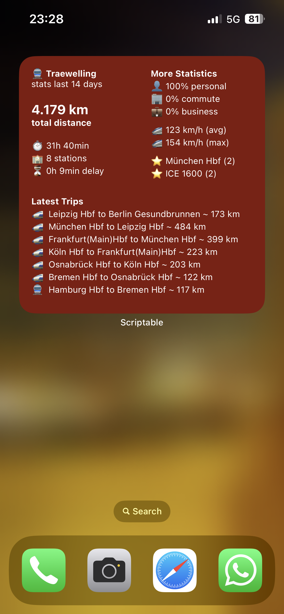
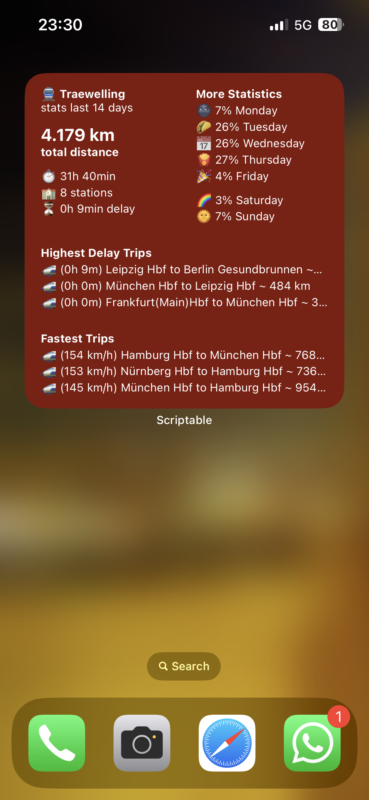

# Traewelling Widget
[](https://github.com/tiuub/traewelling-widget/releases/latest)
[](https://github.com/tiuub/traewelling-widget/releases/latest)
[](https://github.com/tiuub/traewelling-widget/issues)
[](https://github.com/tiuub/traewelling-widget/blob/master/LICENSE)


Traewelling Widget is a iOS widget for [Scriptable](https://scriptable.app/), which shows some advanced statistics about your logged train rides on [Traewelling](https://traewelling.de) on your homescreen.


## Installation

 - Download [Scriptable](https://scriptable.app/) from the [App Store](https://apps.apple.com/de/app/scriptable/id1405459188)
 - Download the latest TraewellingWidget.js from releases [here](https://github.com/tiuub/traewelling-widget/releases/latest).
 - Copy the TraewellingWidget.js to your Scriptable folder in Files (iCloud).


### Configure Widget

 - Long press anywhere on your Homescreen and click on the **+**
 - Search for **Scriptable**, select the formfactor you want to have and place it wherever you want
 - Long press the widget and click on **Edit Widget**
 - Select **TraewellingWidget**, set *When interacting* to **Run Script** and paste your configuration JSON at **Parameter**. (For configuration, see below)


### Authorization

- After configuration, the widget should state something like *this profile is unauthenticated*
- Click on the widget and follow the steps of the authorization flow
- When done, there should be a pop up window

*(Hint: If you have configured a big timespan, f.e. more than 14 days in the past, the script might timeout a few times on first start. This should fix by itself. This happens due to iOS widget timeout limitations. It will work after the script has cached some statistics.)*

## Configuration

If you want to use a custom configuration. You have to set your configuration as json in the widget parameters.

- Long press your widget
- Click **Edit Widget**
- Paste your json in **Parameter**

### Profile (Optional)

The profile parameter is used to have multiple widget configurations for different traewelling accounts. 

If not set, the default value is used.

> Default: 0

Usage:
```json
{
    "profile": "my-second-profile"
}
```

### Days (Optional)

The days parameter is used to analyze all statistics within the specified time range.

If not set, the default value will be used.

> Default: 14

Usage:

```json
{
    "days": 28,
}
```

### Date (Optional)

The date parameter is utilized to examine all statistics up to the specified date.

There is no default for the date parameter.

> *Note: The date parameter will override the days parameter, if set.*

Usage:

```json
{
    "date": "2023-10-01",
}
```

### Schemes

If you want to use a custom scheme for your widget, you can set this through the schemes parameter in the configuration.

If not set, the default value will be used.

> Default: *see in script* 

Usage:

```json
{
    "schemes": {
        "small": [
            [[["title", "noSpacer", "subtitle", "spacer", "distance", "spacer", "duration", "stations", "delay"]]], 
            [[["title", "noSpacer", "subtitle", "spacer", "distance", "spacer", "purposePersonal", "purposeCommute", "purposeBusiness"]]],
        ], 
        "large": [
            [[["title", "noSpacer", "subtitle", "spacer", "distance", "spacer", "duration", "stations", "delay"], ["moreStats", "minSpeed", "avgSpeed", "maxSpeed", "spacer", "purposePersonal", "purposeCommute", "purposeBusiness", "spacer", "favouriteStation"]], [["latestTrips"]]],
            [[["title", "noSpacer", "subtitle", "spacer", "distance", "spacer", "duration", "stations", "delay"], ["moreStats", "categoryExpress", "categoryRegional", "categoryUrban", "spacer", "purposePersonal", "purposeCommute", "purposeBusiness", "spacer", "favouriteStation"]], [["longestTrips"]]],
            [[["title", "noSpacer", "subtitle", "spacer", "distance", "spacer", "duration", "stations", "delay"], ["moreStats", "minSpeed", "avgSpeed", "maxSpeed", "spacer", "categoryExpress", "categoryRegional", "categoryUrban"]], [[{"name": "highestDelayTrips", "args": {"maxTrips": 3}}]], [[{"name": "fastestTrips", "args": {"maxTrips": 3}}]]]
        ]
    }
}
```

## Scheme Documentation

If you want to use a custom scheme for your widget, you can do so, by modifying the scheme in your configuration.

## Troubleshooting

### Wrong name of Script

The correct naming of the script is important. Unless the script has the correct name, it wont work. Sometimes Safari or other browser will name downloaded files with increments, if they already exists in the downloads folder. Then you have to rename the downloaded script to ```TraewellingWidget.js```. 

Examples:
- ~~```TraewellingWidget (2).js```~~ to ```TraewellingWidget.js```
- ~~```TraewellingWidget 2.js```~~ to ```TraewellingWidget.js```

The correct naming is important!


# Previews

<div style="display:flex">
     <div style="flex:1;padding-right:20px;">
          
     </div>
     <div style="flex:1;padding-right:20px;">
          
     </div>
     <div style="flex:1">
          
     </div>
</div>
